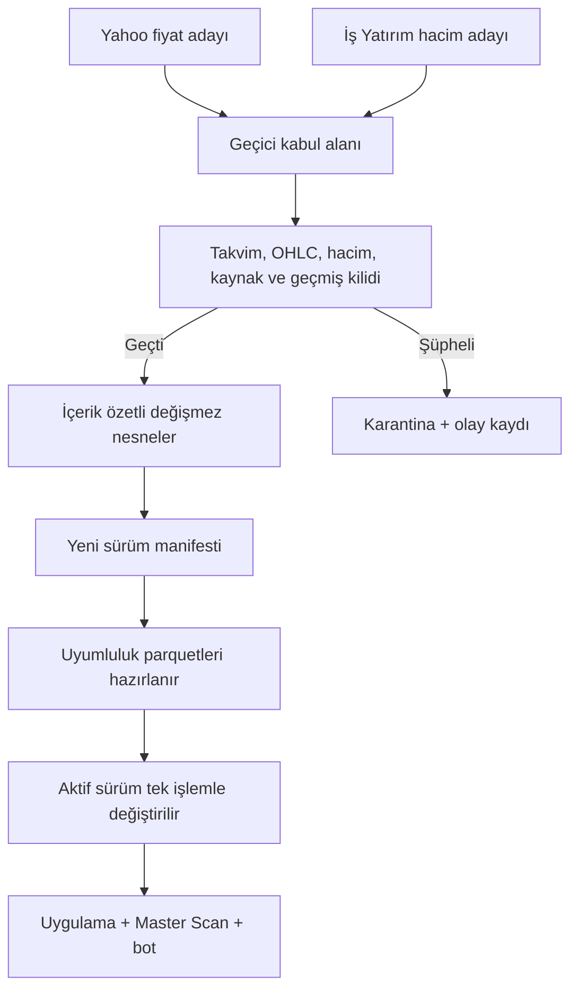

# BIST VERİ ÇEKME VE ONAY PROTOKOLÜ

Son güncelleme: 5 Ağustos 2026

Bu protokol yalnız BIST günlük verisi içindir. ABD, kripto, emtia, saatlik ve 4 saatlik veri bu mimarinin kapsamında değildir.

## 1. Değişmez kurallar

- Fiyatın patronu Yahoo’dur: `Open, High, Low, Close`.
- Hacmin patronu İş Yatırım’dır: TL hacim / ağırlıklı ortalama fiyat = lot.
- Sağlayıcı cevabı ana veriye doğrudan yazılmaz; önce aday alana iner.
- Ana veri tek tek dosyaların “son hali” değil, kimliği olan onaylı bir sürümdür.
- Uygulama, Master Scan ve Telegram botu yalnız aktif onaylı sürümü okur.
- BIST günlük ana kasasının tek yazıcısı VPS’tir.
- Lokal kapanış düzeltmesi yalnız aday paket gönderir; VPS dosyalarını ezmez.
- Aktif sürüm işareti bütün kontroller ve dosya hazırlıkları bittikten sonra en son değişir.

## 2. Veri akışı

## 3. Sürüm kasası

Kök: `health/bist_store/`

- `objects/`: içerik özetiyle adlandırılan değişmez parquet nesneleri.
- `manifests/`: her onaylı turun sürüm kaydı.
- `active.json`: okuyucuların gördüğü tek aktif sürüm işareti.
- `staging/`: henüz kabul edilmemiş geçici veri.
- `quarantine/`: reddedilen semboller, günler ve gerekçeler.
- `inbox/`: VPS’e gelen lokal aday paketleri.
- `outbox/`: lokal adayları ve onaylı senkron paketleri.

Her manifest şunları saklar:

- sürüm kimliği ve zamanı;
- önceki sürüm;
- turun nedeni ve kaynak özeti;
- sembol başına nesne özeti, satır sayısı, ilk/son tarih;
- fiyat ve hacmin hangi kaynaktan geldiği;
- eklenen, değiştirilen ve reddedilen günler;
- kalite durumu ve uyarılar;
- taşınarak korunan eski semboller.

Geri dönüş sağlayıcıya gitmeden yapılır:

`python bist_exchange.py rollback SURUM_KIMLIGI`

## 4. Kabul kapıları

Her aday için:

1. Gelecek tarih, hafta sonu ve BIST tatili reddedilir.
2. Aynı tarih iki kez geldiyse yinelenen kayıt raporlanır.
3. Açılış/yüksek/düşük/kapanış pozitif ve matematiksel olarak tutarlı olmalıdır.
4. Yahoo yalnız fiyat; İş Yatırım yalnız hacim alanına dokunabilir.
5. Bugünkü Yahoo hacmi yalnız geçici hacim sayılır.
6. Son dört işlem günü kontrollü biçimde güncellenebilir.
7. Daha eski bir bar otomatik değiştirilemez; özel onarım gerekir.
8. Eski sağlam geçmiş aday kısa geldi diye kaybolmaz; önceki sürümden taşınır.
9. Kanıtsız yüzde 35 üzeri fiyat sıçraması reddedilir.
10. İkinci kaynakla son fiyat ayrışması yüzde 5’i aşarsa reddedilir.
11. Kritik endeks adaylarından biri bozuksa turun tamamı durur.
12. Sembol reddedilirse önceki sağlam nesnesi aktif sürümde kalır.

Eski gün onarımı ancak iki kanıtla yapılır: Yahoo fiyat barı + İş Yatırım hacmi/kapanış referansı. Kaynak kapalıysa gün “tatil” sayılmaz; belirsiz olarak alarmda kalır.

## 5. Tek yazıcı ve lokal kapanış

`settle_kapanis.py` lokal Yahoo’dan toplu kapanış alır fakat `veriler/` dosyalarını değiştirmez. Değişen son barları, paketin bağlı olduğu aktif sürüm kimliğiyle ZIP adaya dönüştürür.

`run_settle.sh` yalnız bu ZIP’i VPS `inbox` klasörüne yollar. VPS:

1. paketin ebeveyn sürümünü kendi aktif sürümüyle karşılaştırır;
2. sürüm değişmişse paketi `stale_parent` gerekçesiyle karantinaya alır;
3. aynıysa normal kabul kapılarından geçirir;
4. yalnız başarılıysa yeni sürüm yayınlar.

Lokalden VPS’e toplu parquet kopyalama kaldırılmıştır.

## 6. VPS → lokal senkron

`sync_from_vps.sh` artık `veriler/` klasörüne kör tar açmaz.

1. Lokal aktif sürüm kimliğini VPS’e bildirir.
2. VPS yalnız değişen nesneleri ve tam manifesti onaylı ZIP’e koyar.
3. Lokal her nesnenin SHA-256 içeriğini manifestle doğrular.
4. Eksik veya bozuk tek nesne varsa paket reddedilir.
5. Nesneler yerleştirilir, uyumluluk dosyaları hazırlanır.
6. Lokal `active.json` en son değişir.

## 7. Sağlayıcı trafik polisi

`provider_traffic.py` bütün süreçlerin ortak durumunu `health/provider_traffic.json` içinde tutar.

- İş Yatırım, Yahoo ve borsapy için ayrı istek aralığı ve dakikalık bütçe vardır.
- İstekler arasına küçük rastgele gecikme eklenir.
- Ölçüm probu bütçenin en fazla yarısını kullanabilir; kapanış/final işler önceliklidir.
- 403/429 bütün çalışanlarda ortak bekleme başlatır.
- Sağlayıcının `Retry-After` süresi varsa aynen uygulanır.
- Art arda zaman aşımı/bağlantı/boş cevap ortak sigortayı açar.
- Başarısız sembol aynı süreçte saldırgan biçimde tekrar denenmez.
- `settle_probe.py` 20 işlem günü tamamlanınca kendini otomatik durdurur.

Varsayılan bütçeler ortam değişkenleriyle değiştirilebilir; ölçüm olmadan “kesin güvenli istek sayısı” iddiası yoktur.

## 8. Okuyucular ve hız

- `data_layer.get_safe_historical_data`: tek hisseyi aktif sürümden okur.
- `data_layer.get_batch_data_cached`: Master Scan’i aktif sürüm kimliğiyle önbellekler.
- `smr_core.get_data`: Telegram botunda aynı aktif sürümü okur.

BIST günlük okuma yolu ağ erişimi, dosya silme ve parquet yazma yapmaz. Aktif sürüm kimliği önbellek anahtarıdır; yeni sürüm yayınlanınca okuyucular yeni kimlikle otomatik tazelenir.

5 Ağustos ilk ölçümü:

- TTKOM: 274 bar, 129 ms;
- THYAO: 273 bar, 41 ms;
- üç hisselik toplu okuma: 262 ms;
- bot TTKOM okuması: 221 ms.

## 9. Final hacim ve delik onarımı

`finalize_volume.py` aktif sürümdeki tüm BIST hisselerini önce İş Yatırım bütçesiyle tarar. Sağlayıcı hedef gün için cevap vermezse, yalnızca beklenen son işlem günü için borsapy/TradingView günlük verisiyle kontrollü yedek aday üretir. Hedef gün, aktif kapanış ve bariz hacim ölçek anomalisi kapıları geçilmedikçe aday alınmaz. Borsapy adayı aktif manifestte `controlled_fallback` olarak kalır; resmî `verified` hacim sayılmaz ve tarihsel backtest ana kaynağına dönüştürülmez. En az yüzde 85 kapsama oluşmadan yeni sürüm veya “final hacim” işareti üretmez.

`delik_alarmi.py`:

- çoğunlukla açık olduğu kanıtlanan işlem günündeki eksikleri bulur;
- İş Yatırım gelmiyorsa “tatil” demez, `KAYNAK YOK` alarmı verir;
- `--fix` modunda Yahoo fiyatı ve İş Yatırım referansı uyuşmadan yazmaz;
- doğrulanmış eski gün onarımını özel `repair` kapısından sürüme teklif eder.

Eski `fix_recent_close.py` doğrudan yazıcısı emekliye ayrılmıştır.

## 10. İzleme ve test

JSON/terminal sağlık raporu:

`python bist_data_status.py`

Bağımsız izleme ekranı:

`streamlit run bist_data_monitor.py`

Ekran/rapor; aktif sürüm, yaş, sembol sayısı, son bar dağılımı, geçici hacimler, uyarılı semboller, son karantinalar, sağlayıcı başarı/hata ve ortak bekleme süresini gösterir.

Üretim verisine dokunmayan kabul/rollback/senkron testi:

`python bist_data_store_selftest.py`

Mevcut kasa ilk sürüm öncesi kuru kontrol:

`python bist_bootstrap_audit.py`

## 11. İlk aktif sürüm

5 Ağustos 2026’da mevcut 618 BIST sembolü kontrol edildi:

- 618 sembolün sağlam gövdesi aktif sürüme alındı;
- 39 semboldeki matematiksel olarak bozuk günler ayrı karantinaya alındı;
- hiçbir sembol bütünüyle kaybedilmedi;
- resmî tatillerdeki düz ve sıfır hacimli Yahoo kopyaları veri sayılmadı;
- ilk sürüm: `bootstrap-20260805T103020-70223940`.

## 12. İlgili dosyalar

- `bist_data_store.py`: kabul, sürüm, karantina, geri dönüş.
- `bist_exchange.py`: aday paketi ve onaylı sürüm aktarımı.
- `provider_traffic.py`: ortak istek bütçesi ve sigorta.
- `isyatirim_gateway.py`: gerçek HTTP zaman aşımı, cache ve İş Yatırım cevabı.
- `fetcher.py`: VPS aday üreticisi.
- `data_layer.py`: uygulama/Master Scan aktif sürüm okuyucusu.
- `smr_core.py`: bot aktif sürüm okuyucusu.
- `settle_kapanis.py` + `run_settle.sh`: lokal kapanış adayı.
- `sync_from_vps.sh`: onaylı sürüm senkronu.
- `finalize_volume.py`: kapsama kapılı final hacim turu.
- `delik_alarmi.py`: delik alarmı ve kanıtlı özel onarım.
- `bist_data_status.py` + `bist_data_monitor.py`: izleme.
